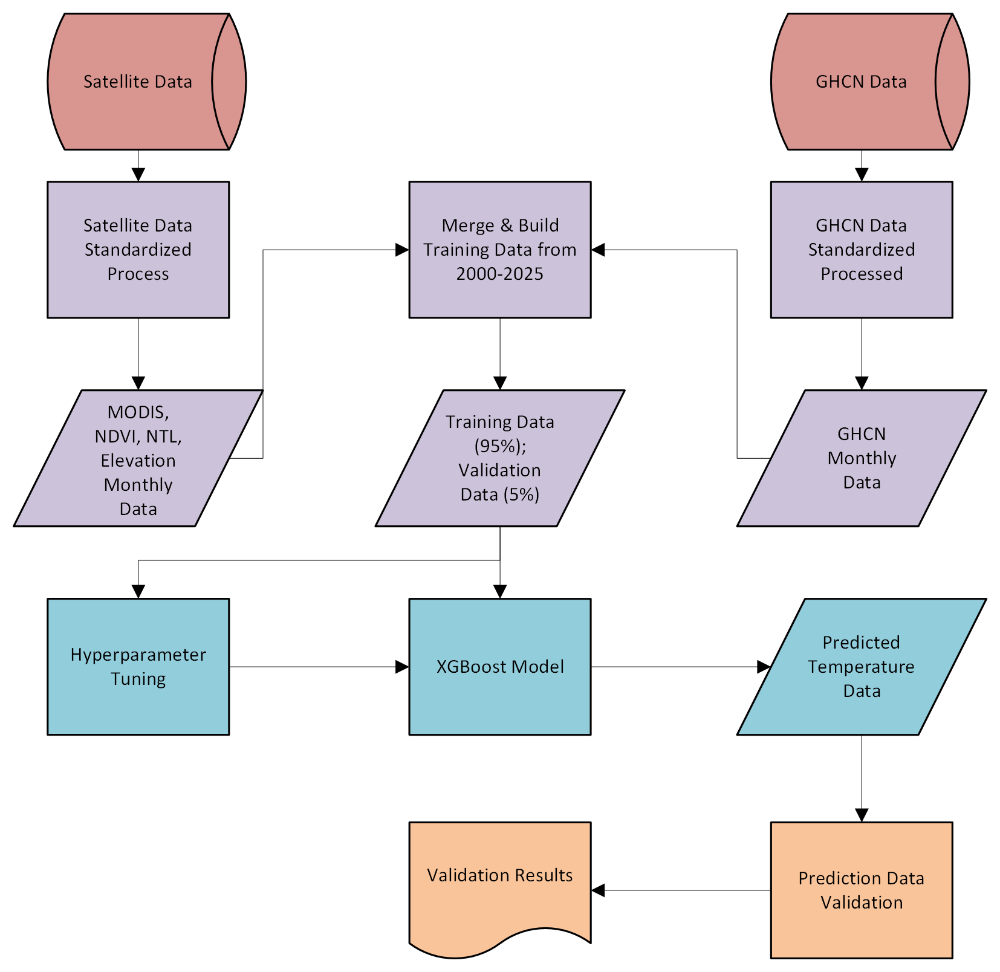

# v0.0.0

## Aim
Global Prediciton of Temperature with a fine resolution.

## Workflow

## Sub-task Division
1. ESG08b2a: this task is to merge and prepare training data using monthly readings from GHCN, MODIS, NDVI, and NTL data. (Purple)
2. ESG08b2b: this task is to conduct hyperparameter training to find the best parameters for the XGBoost model -> using best parameters, train the XGBoost model using best parameters. (Blue)
3. ESG08b2c: this task is to evaluate and validate the predictions of the XGBoost model. (Orange)

## Logs:
- 2025/10/23
Start Experiment 001 to finish the first goal.
## Issues:

## Signature: